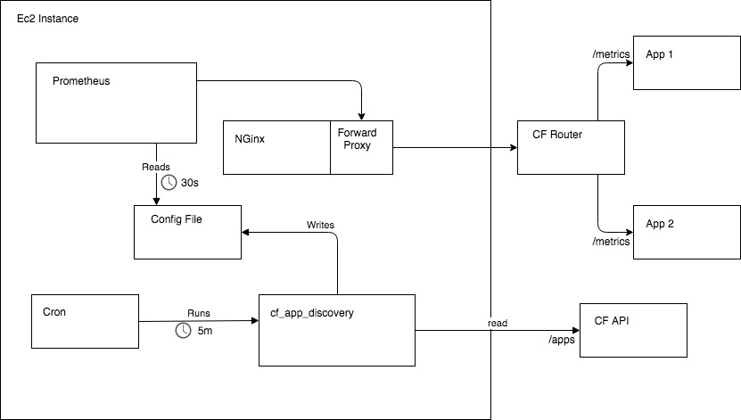

## cf_app_discovery

Discover apps using the Cloud Foundry API and write a Prometheus targets config.

## Overview

Tool for application discovery in the [PaaS](https://docs.cloud.service.gov.uk) platform to allow dynamic creation of target files for Prometheus metrics re-collection.

## Detail

The tools use the PaaS Cloud Foundry API to discover running apps in the platform.

Once the list of available apps has been obtained, it filters out "STOPPED" applications or applications not configured to work with Prometheus.

With the final list of running applications configured fro Prometheus, the corresponding target files are created to allow Prometheus to load the new targets.

#### When an application is configured for Prometheus?

To configure a PaaS application to be discovered need to have defined an environment variable with the scrapping path:
```
PROMETHEUS_METRICS_PATH: /prometheus
```

#### Diagram



## Usage

```bash
$ bundle --without development

$ export API_ENDPOINT=<api_endpoint>
$ export UAA_ENDPOINT=<uaa_endpoint>
$ export UAA_USERNAME=<username>
$ export UAA_PASSWORD=<password>
$ export PAAS_DOMAIN=<paas_domain>
$ export TARGETS_PATH=<targets_folder>

$ ./cf_app_discovery
```

## Forward Proxy

To fetch metrics from a specific instance of an app, you need to set the
`X-CF-APP-INSTANCE` header on outbound requests to Cloud Foundry
([docs](https://docs.cloudfoundry.org/devguide/deploy-apps/routes-domains.html#routing-requests-to-a-specific-app-instance)).
This application configures targets with a query parameter for this, so you'll
need to convert this to a header and use a forward proxy to set the header, e.g.

```
server {
  listen 8080;
  resolver 10.0.0.2;

  location / {
    proxy_pass https://$host$uri;
    proxy_ssl_server_name on;
    proxy_set_header X-CF-APP-INSTANCE $arg_cf_app_guid:$arg_cf_app_instance_index;
  }
}
```

Currently, Prometheus doesn't support setting headers (other than basic auth) on
outbound requests.

## User Agent

This application sets a custom user agent string of
`cf_app_discovery - GDS - RE` to requests to fetch the application data.

## Deployment

There's [a script in `deploy/`](./deploy/cf_app_discovery)
that shows how we run the application. We fetch
the secrets from
[AWS Parameter Store](https://docs.aws.amazon.com/systems-manager/latest/userguide/systems-manager-paramstore.html)
and run the application every few minutes with Cron. Our terraform scripts
can be found [here](https://github.com/alphagov/prometheus-aws-configuration).
